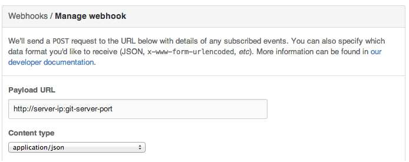

Operias
=======

Operias is an open source tool that produces a coverage difference report between two versions of a software project. Operias can be run as a standalone version (operias-report) that creates a coverage diff report for two given versions of code, the other is a tool that provides integration with GitHub Pull Requests (operias-servlet). Currently, Operias supports only maven based Java projects, future extensions will support other Java build tools.

Demo
=======
For a short demo on how this tool works please watch the video at https://youtu.be/2Dpigi5ghZE

Compilation of the tool
=======

To compile the operias-report standalone tool, the following command should be issued in the operias-report directory.
```
  mvn clean compile assembly:assembly -DskipTests=true
```

For the operias-servlet tool, it is important that the operias-report tool is installed in your local maven repository. This can be acheived with the aid of the following command in operias-report directory:

```
  mvn install
```

The operias-servlet tool can then be compiled using the command:

```
  mvn clean compile assembly:assembly -DskipTests=true
```

Running Operias Report
=======

The operias-report tool can be executed using the following command:
```ini
  java -cp '<path-to-operias-report>/target/operias-report-<version>-jar-with-dependencies.jar' operias.Main <args>
```

##Flags
This table shows all the possible flags that can be used when running operias-report.

Parameter | Short parameter name | Description | 
----------|----------|-----------|
--destination-directory | -d | The directory where the generated site will be placed
--revised-directory | -rd | This directory contains the revised source code, this directory will be compared to the original directory. This should be the project directory containing the main pom.xml.
--original-directory | -od | This directory contains the original source code, unchanged. This should be the project directory containing the main pom.xml.
--repository-url | -ru | Instead of providing a directories containing the versions, you can also give a git url. Operias will clone the repository into it's own temporary repository directory.
--original-repository-url | -oru | The git url used for the original version of the source code.
--original-commit-id | -oc | Operias will checkout to this commit to use as original source code. 
--original-branch-name | -obn | Operias will checkout to this branch to use as original source code. 
--revised-repository-url | -oru | The git url used for the revised version of the source code.
--revised-commit-id | -rc | Operias will checkout to this commit to use as revised source code.
--revised-branch-name | -rbn | Operias will checkout to this branch to use as revised source code.
--temp-directory | -td | If Operias fails to execute, it is possible it does not have the rights to create a temporary folder, use this parameter to set your own temporary directory for Operias. Be aware, it will delete all the contents of the temporary folder when the execution has completed
--verbose | -v | Provide this parameter enable the output of errors, warnings and info messages


Running Operias Servlet
=======

The operias-servlet tool can be executed using the following command:
```ini
  java -cp '<path-to-operias-servlet>/target/operias-servlet-<version>-jar-with-dependencies.jar' operias.servlet.OperiasServlet <args>
```

##Setup of the tool
To enable a project to use the operias-servlet tool, the project must have a webhook which connects to the IP address of the machine that is running the operias-servlet. For example: 



The option to add a webhook can be found under Settings -> webhooks. More information can be found [here](https://developer.github.com/webhooks/creating/). 

##Flags
This table shows all the possible flags that can be used when running operias-servlet.

Parameter | Short Parameter | Description |
----------|-----------------|------------|
--server-ip | -ip | This is the IP of the server on which the webhook runs
--git-server-port | -gp | The port used for received the data from GitHub
--html-server-port | -hp | The port on which the generated HTML sites are hosted
--temporary-directory | -td | A local directory which Operias can use to store intermediate results during execution
--results-directory | -rd | A local directory which is used to store the generated reports in
---username | -u | The username of the GitHub account, which is used to post the comments
--poassword | -p | The password of the GitHub account
